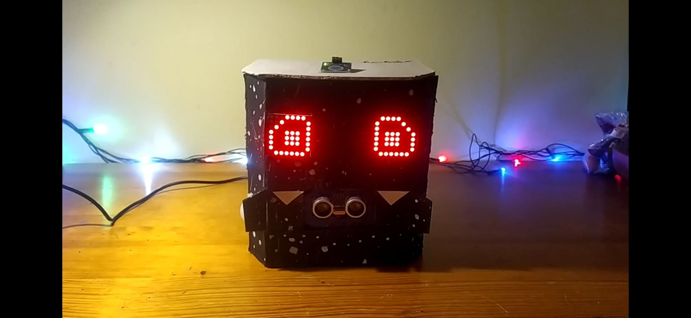
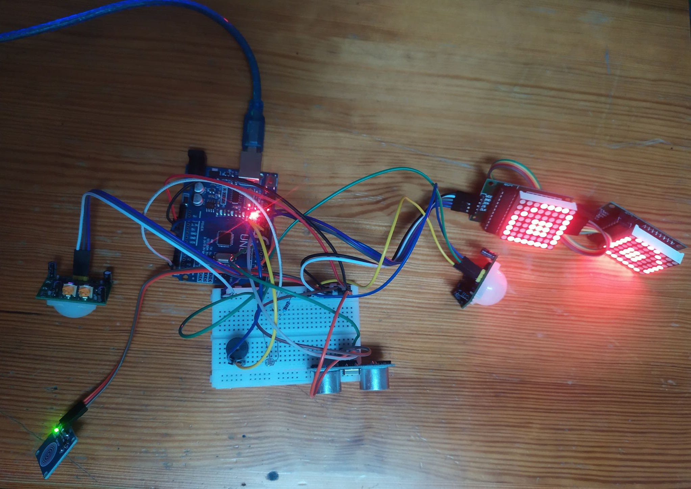
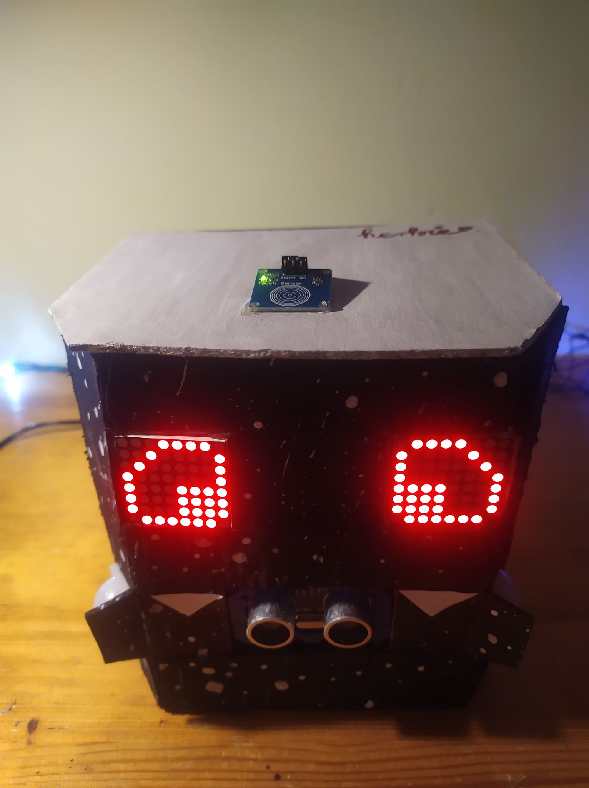
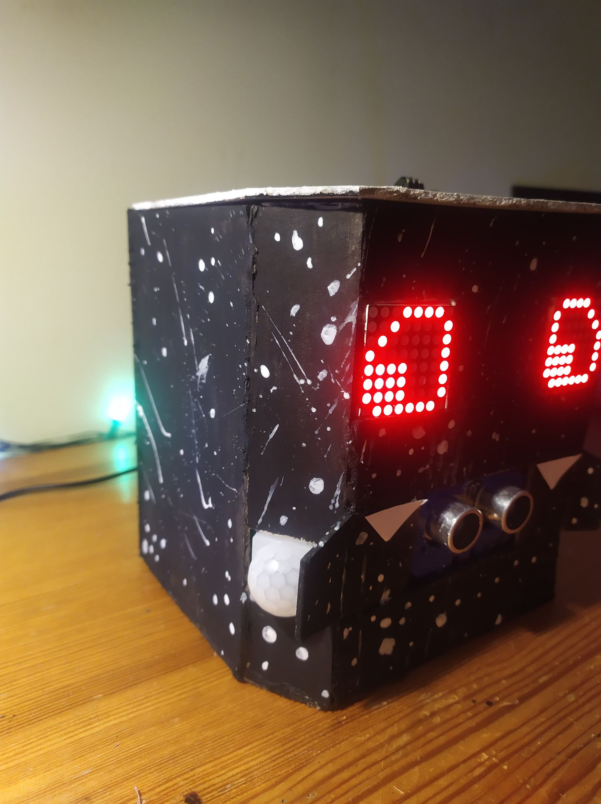
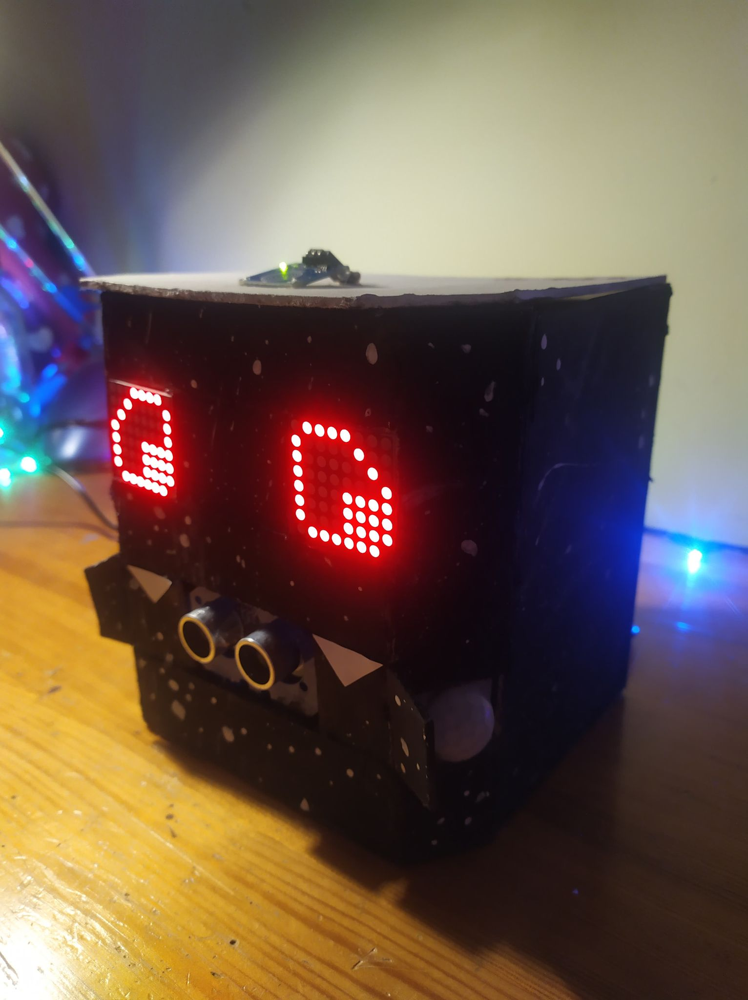
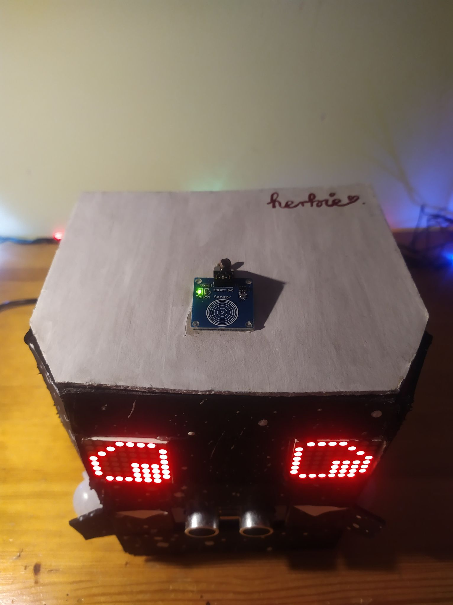
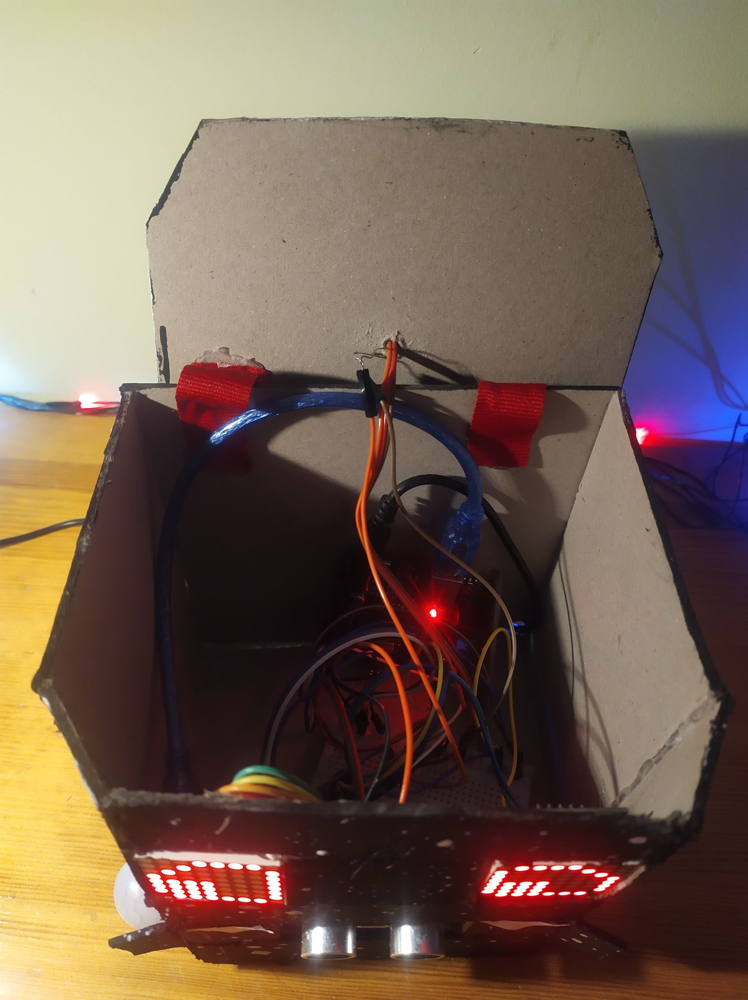

<h1 align="center">
	Herbie
</h1>
<h2 align="center">
    🤖❤️👨‍🦲
     
    Interactive robot
</h2>

     
    

## Table of contents
* [Idea](#idea)
* [Modules](#modules)
* [Connections](#connections)
* [Features](#features)
* [Presentation](#presentation)

## Idea
**Ideas that came to my mind and what I wanted to achieve:**
* Something like an interactive robot
* Visual and sound responses
* Blinking eyes
* Human tracking
* Reactions "of eyes" like: happy, nervous, sleepy...
* Touch detection
* Going to sleep when darkness is detected in the room

## Modules
**What I need to make all ideas come true:**
* Arduino - I chose Uno version
* 2x LED Matrices 8x8 with MAX7219 control system - projecting eyes
* 2x Motion sensor HC-SR501 - human tracking on the left & right
* Distance sensor HC-SR04 - also human tracking
* Touch sensor TTP223B - touch detection of course
* Photoresistor - light detection
* Buzzer

*In addition, a breadboard and wiring. To control matrices it's required to import [LedControl](https://www.arduino.cc/reference/en/libraries/ledcontrol/) library. Specific eye states displayed on matrices will be in the form of a byte array, where each element will correspond to one row / column of LEDs on the matrix.*

## Connections
* **2x LED Matrices 8x8**
    * connected in series (one by one)
    * VCC -> 5V, GND -> GND
    * CS -> 10 pin
    * DIN -> 11 pin
    * CLK -> 12 pin
* **2x Motion sensors HC-SR501**
    * VCC -> 5V, GND -> GND
    * OUT ->
        * 2 pin for left sensor
        * 9 pin for right sensor
* **Distance sensor HC-SR04**
    * VCC -> 5V, GND -> GND
    * Trig -> 7 pin
    * Echo -> 6 pin
* **Touch sensor TTP223B**
    * VCC -> 5V, GND -> GND
    * SIG -> 13 pin
* **Photoresistor**
    * One leg -> 5V
    * One leg -> A5 pin & through resistor -> GND
* **Buzzer**
    * One leg -> 5V
    * One leg -> through resistor (to make it quieter) -> GND

<h2>
    How it looks like:
</h2>

    
     

It looks like a mess, doesn't it? 😅 It definitely doesn't look like a robot, so as the next goal, I decided to create a kind of "case" that could organize these modules somehow.

The case is made of thick cardboard and everything has been glued together with hot glue.

What is more, it was necessary to add "wings" to the motion sensors because the motion detection angle was too large and it interfered with proper work.

I painted the whole case and at the end I found out that it looks like a little bat, so I added some little teeth 😊🦇

## Features
* Blinking eyes at irregular times
* Detecting motion on the left and right side - looking at these places
* Squiting when it detects a close obstacle
* Confusion effect after detecting motion from multiple sides
* Happiness effect (visual & sound) after stroking (holding the touch sensor on the "head")
* Nervous effect (visual & sound) after tap on the head
* Going to sleep when low light is detected in a room
* Interrupting sleep when tapping on the head

## Presentation
**How Herbie looks like now:**

    
     
    
     
    
     
    
     
    

**And for the most persistent ones 😅 [this is how Herbie works](video/herbie_video.mp4)**

<h2 align="center">
	Thanks and I hope U like it! 🤖❤️
</h2>